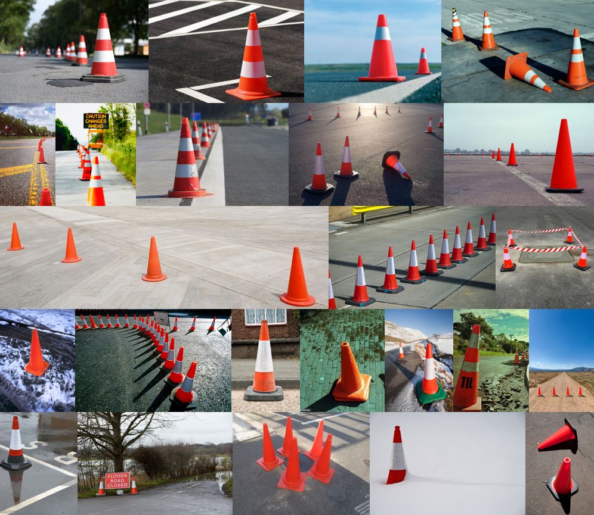

# TraCon: A novel dataset for real-time traffic cones detection using deep learning

The dataset contains RGB data from heterogeneous sources and sensors (e.g., DSLR cameras, smartphones, UAVs). Furthermore, the images vary in terms of illumination conditions (e.g., overexposure, underexposure), environmental landscapes (e.g., highways, bridges, cities, countrysides), and weather conditions (e.g., cold, hot, sunny, windy, cloudy, rainy, and snowy). In parallel, several images include various types of occlusions, thus making the traffic cone detection task more challenging. Each RGB image has a corresponding .txt file with the bounding box information of the traffic cones (YOLO annotation format: <i><object-class> <center_x> <center_y> <width> <height></i>).

The total number of RGB images in the dataset is 540 with various resolutions ranging from 114×170 to 2,100×1,400. It is underlined that the total number of traffic cones in the entire dataset is 947. Representative samples of the dataset are demonstrated in the figure below. From the images of the whole dataset, 92.5% were used for training the deep model, and 7.5% for testing its effectiveness. Among the training data, 80% of them were used for training and the remaining 20% for validation.

